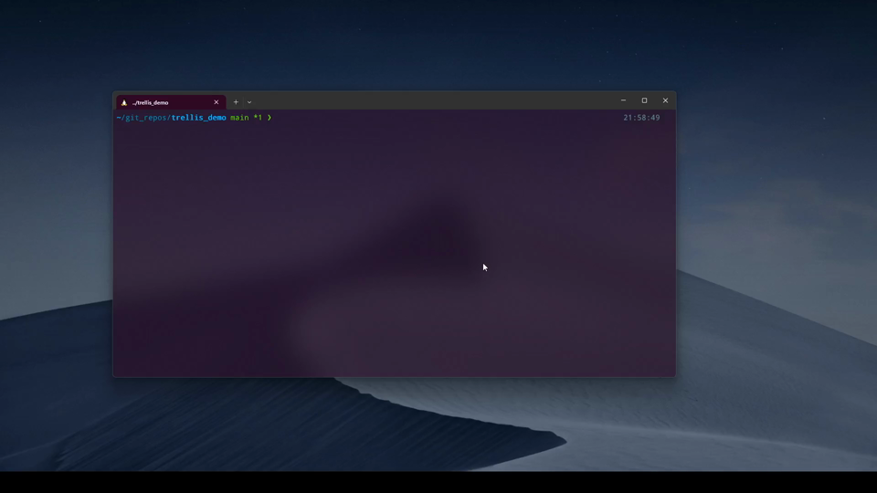
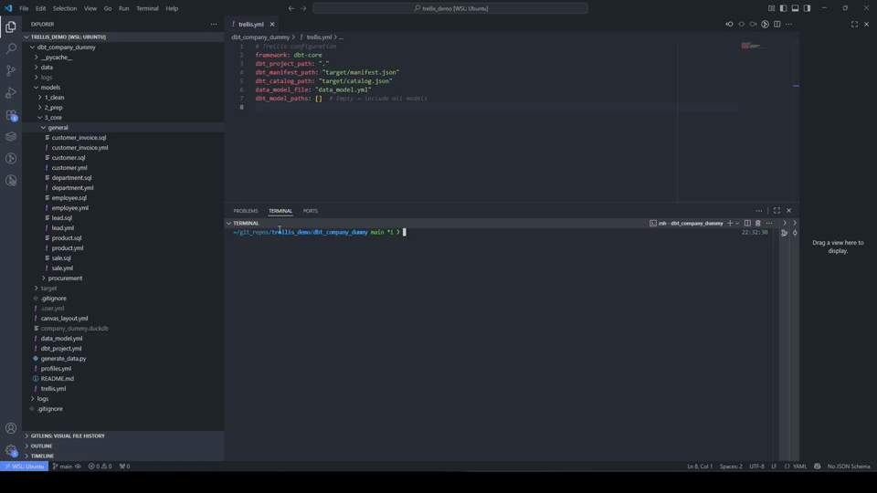
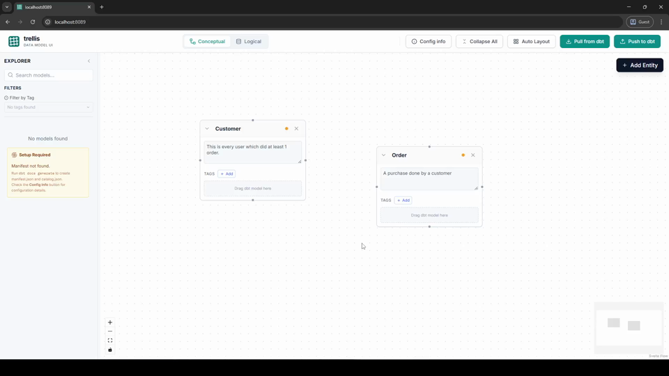
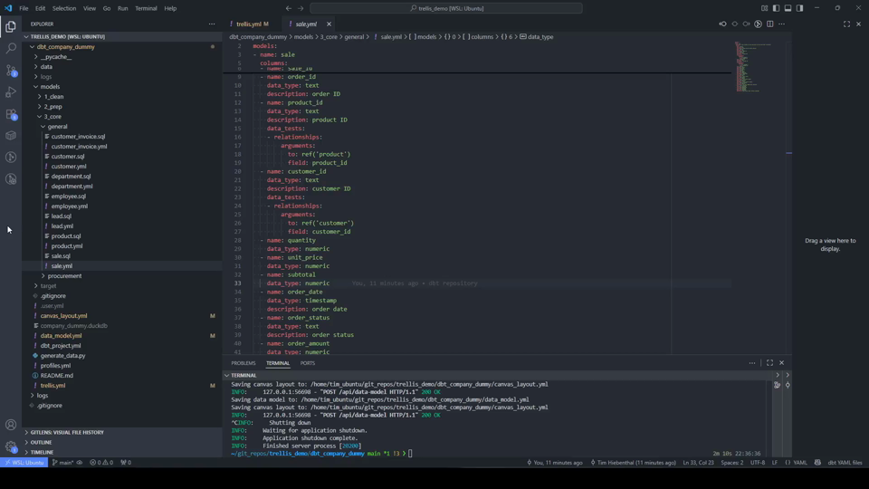
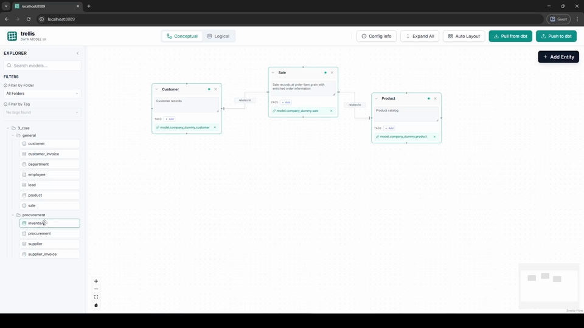
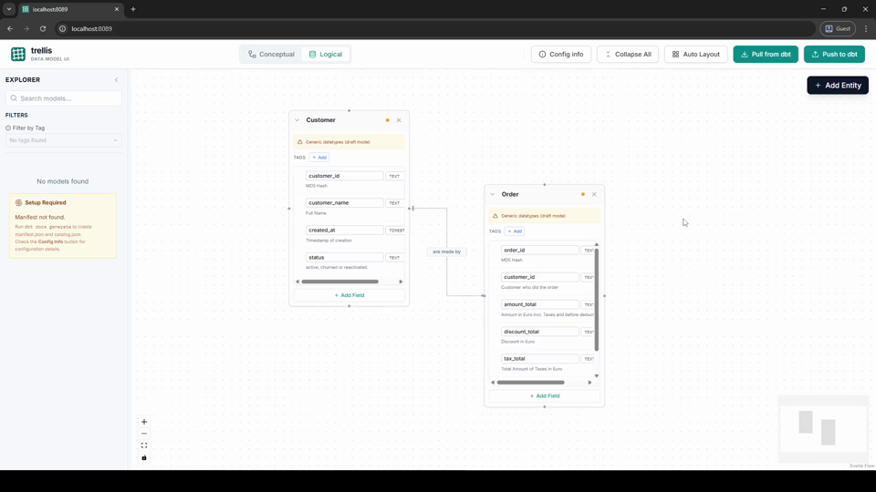

# Trellis Tutorial

This tutorial guides you through the core features of Trellis, a visual data modeling tool for dbt projects.

> Note: GitHub-flavored Markdown does **not** reliably inline-embed repo-hosted `.mp4` files in Markdown documents.
> The most reliable approach is a **clickable thumbnail** that links to the video (as described here: https://www.geeksforgeeks.org/git/how-to-embed-a-video-into-github-readme-md/).

## 1. Initializing Trellis
When you start a new project, the first step is to initialize Trellis in your project directory.

1. Open your terminal in your dbt project root.
2. Run `trellis init`.
3. This creates a `trellis.yml` configuration file.

## 2. Connecting to dbt
Trellis needs to know where your dbt project and its artifacts (`manifest.json` and `catalog.json`) are located.

1. Edit the generated `trellis.yml`.
2. Ensure `dbt_project_path` points to your dbt project.
3. Trellis uses `manifest.json` to understand your project structure and `catalog.json` to get column types.
4. Run `dbt docs generate` in your dbt project to ensure these files are up-to-date.

## 3. Creating your first Model
Trellis allows you to sketch out your data model before writing any SQL.

1. Start the server with `trellis run`.
2. In the UI, use the sidebar to add new entities.
3. You can define fields, types, and descriptions visually.
4. Trellis provides two views:
    - **Conceptual View**: Focuses on business entities and their high-level descriptions.
    - **Logical View**: Shows technical details like column types and materializations.
5. **Advanced Entity Binding**:
    - You can bind a single conceptual entity to one or more dbt models.
    - If no dbt model exists yet, use **Drafted Fields** to define the structure you need.
6. When you save your changes, Trellis creates a `data_model.yml` and `canvas_layout.yml` to track your visual state.

## 4. Using the Example Project
If you want to explore Trellis without your own dbt project, you can generate an example commercial company model.

1. Run `trellis generate-company-data`.
2. This creates a `dbt_company_dummy` directory with mock data for customers, orders, products, etc.
3. You can then point Trellis to this directory in your `trellis.yml`.

## 5. Visualizing Existing dbt Relationships
If you already have a dbt project with relationship tests, Trellis can automatically draw these on the canvas.

1. Use the "Read dbt Relationships" feature in the UI.
2. Trellis scans your dbt schema YAML files for `relationships` tests.
3. It automatically draws edges between entities based on these tests.
4. You can manually adjust relationship labels and their positions (`label_dx`, `label_dy`) to keep the canvas clear.

## 6. Organizing with Folders
Large data models can become messy. Trellis helps you stay organized by grouping entities.

1. Use the folder structure from your dbt project to organize entities on the canvas.
2. You can filter and group models based on their file paths or dbt tags.
3. Drag and drop entities to arrange them logically.

## 7. Pushing Changes back to dbt
Once you've designed your model visually, you can push those changes back into your dbt project.

1. Click the "Push to dbt" button in the UI.
2. Trellis will update or create dbt schema YAML files.
3. It writes back:
    - Model descriptions
    - Column descriptions and types
    - dbt tags
    - `relationships` tests (based on the edges you drew on the canvas)

By following these steps, you can keep your conceptual design and physical dbt implementation perfectly in sync.
